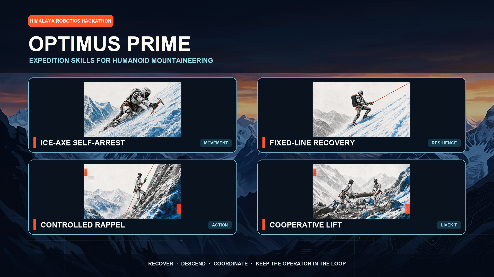

# Optimus Prime submission package

This directory contains the submitted two-minute demo, the 90-second pitch
deck, and every local source needed to edit or regenerate them.



## Final deliverables

- `optimus_prime_g1_expedition_2min.mp4` — 77 seconds, 1080p H.264,
  AAC voiceover, burned-in captions
- `optimus_prime_g1_expedition_2min.srt` — separate subtitle track
- `optimus_prime_pitch_90s.pptx` and `.pdf` — simplified six-slide pitch
- `optimus_prime_pitch_90s_detailed.pptx` and `.pdf` — technical version
- `optimus_prime_pitch_slide_options.pptx` and `.pdf` — each detailed slide
  followed by its simplified alternative
- `pitch_script_90s.md` and `pitch_script_90s_detailed.md` — matching scripts
- `optimus_prime_project_cover.png` — 16:9 cover with all four skills and team name

## Demo structure

| Time | Material |
|---:|---|
| 0:00–0:03.5 | Team/title card |
| 0:03.5–0:08.5 | Four-skill overview |
| 0:08.5–0:16.5 | One hard self-arrest plus evaluation results |
| 0:16.5–0:29.5 | Fixed-line catch, fall recovery on ice, and resumed ascent |
| 0:29.5–0:40 | Standalone learned whole-body get-up |
| 0:40–0:49 | Controlled rappel: brake control plus one foot-placement sequence |
| 0:49–0:57 | Overload refusal, beginning directly on the action |
| 0:57–1:17 | Cooperative lift and LiveKit telemetry/voice control |

The pitch carries the problem, extreme-condition motivation, technical
architecture, and quantified evidence. The demo stays below the two-minute
limit and uses only the footage needed to show each behavior clearly.

## Rebuild the video

Requirements: FFmpeg/ffprobe, Python 3 with Pillow and Requests, and an
`ELEVEN_API_KEY` available to an interactive zsh. Voice files are generated
with ElevenLabs and cached under the ignored `build/audio/` directory.

```bash
cd submission
zsh build_video.sh
```

`build_video.sh` regenerates the theme cards, extracts the intentional source
windows, renders captions, creates the voiceover, and writes the final MP4.
The selected clips are retained under `source_videos/`; edit the FFmpeg trim
windows in the script to change the cut.

To audition another ElevenLabs voice after adding it to My Voices, rebuild with
`ELEVEN_VOICE_ID=<voice-id> zsh build_video.sh`. The default remains George.

## Rebuild the pitch deck

Requirements: Python 3 with Pillow, Node.js/npm, and optionally LibreOffice for
the PDF export.

```bash
cd submission
npm ci
python3 build_assets.py
node build_pitch_deck.js

mkdir -p build/pitch_render
soffice --headless --convert-to pdf \
  --outdir build/pitch_render optimus_prime_pitch_90s*.pptx
soffice --headless --convert-to pdf \
  --outdir build/pitch_render optimus_prime_pitch_slide_options.pptx
cp build/pitch_render/*.pdf .
```

Edit `build_assets.py` for visual content, `build_pitch_deck.js` for slide
assembly and speaker notes, and `pitch_script_90s.md` for the readable script.

Regenerate the project cover with `python3 build_cover.py`. It uses the four
idealized robot illustrations from the evidence slide, placed uncropped with
safe margins over the tracked Himalayan background in `cover_assets/`.

## Source mapping

| Skill | Primary source clips |
|---|---|
| Self-arrest | `g1_self_arrest_diverse_suite.mp4` |
| Fixed-line fall recovery/get-up | `g1_fixed_line_fall_recovery.mp4`, `fall_recovery.mp4` |
| Rappel | `g1_rappel_long.mp4`, `g1_rappel_footplant_full_preview.mp4` |
| Cooperative lift | `tree.mp4`, `lifting_log.mp4`, `failure.mp4` |

Generated visual and reference provenance is recorded in
[`ASSET_PROVENANCE.md`](ASSET_PROVENANCE.md). Build products beneath `build/`
and JavaScript dependencies beneath `node_modules/` are intentionally ignored.
